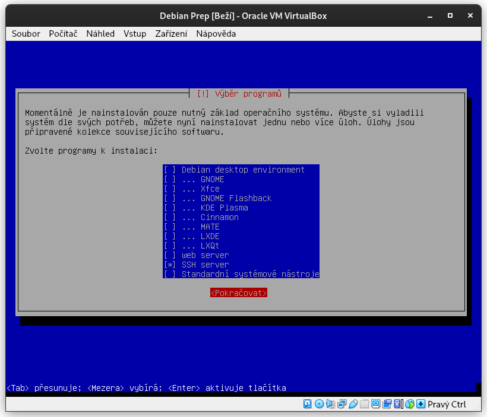
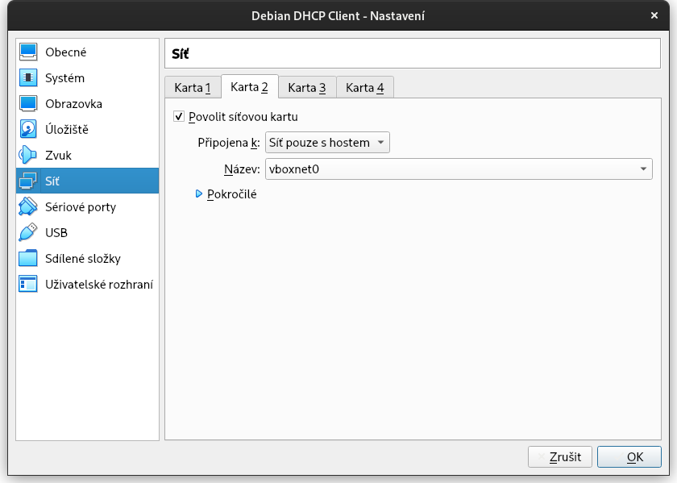
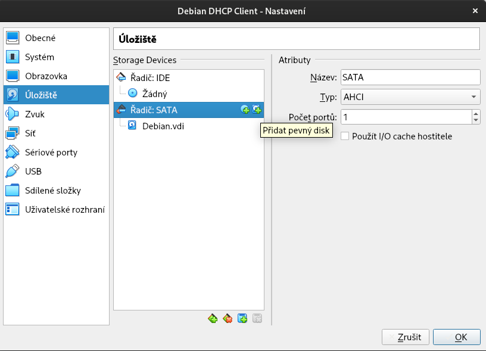
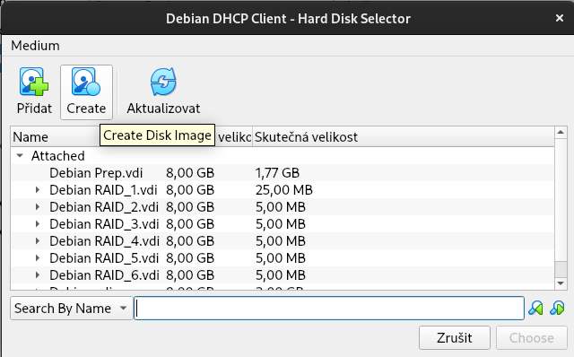

# SOS Knowledge Base

> Tento repositář slouží jako shromaždiště všech možných znalostí (od základních detailů po užitečné maličkosti), které jsem získal a potřeboval v předmětu Správa operačních systémů (SOS) na VŠB-TUO

## Užitečné skripty
Některé úkony popisované v tomto repositáři jsem zapsal do Bash skriptů, které je možné si stáhnout a upravit podle potřeby. Jejich přehled se nachází [ZDE](setup-scripts.md).

## Software pro hostující stroj
Veškerá výuka probíhá s využitím systému Debian GNU/Linux, který je nainstalován v prostředí VirtualBox.

[Instalační obrazy ISO Debianu](https://www.debian.org/CD/http-ftp/)
[VirtualBox](https://www.virtualbox.org/wiki/Downloads)

## Instalace
Pro instalaci postačuje tzv. *netinst* obraz. Je možné využít DVD, které zajistí rychlejší instalaci na pomalejším připojení, ale je pak vhodné v */etc/apt/sources.list* zakomentovat řádek s tímto zdrojem, jinak se bude Debian při instalaci nového softwaru neustále ptát po DVD.

Systém je možno nainstalovat v podstatě mačkáním klávesy ENTER. Doporučený mód je textový, tedy ne *Graphical Install*, protože je to v textovém módu rychlejší. Z volitelných součástí je v podstatě potřeba jen SSH server, jelikož tady v podstatě simulujeme serverovou instalaci.



## Jako root
Přímo v okně Virtualboxu je možné se přihlásit přímo jako uživatel *root* pomocí zvoleného hesla. Můžeme se ale přihlásit i pod obyčejným uživatelem a následně použít příkaz ```su -``` pro přepnutí. Toto se hodí hlavně při připojení přes SSH.

## Základní síť
Po instalaci máme již funkční systém, ale je žádoucí se k němu připojit skrze SSH (přes hostující PC), abychom do něj mohli kopírovat příkazy. V nastavení VirtualBoxu u našeho PC s Debianem přidáme novou síťovou kartu s názvem *Síť pouze s hostem*. Pro toto nastavení musí být virtuální stroj vypnutý.



Po nastartování systému nebude mít nová síťová karta ip adresu. Tu jednoduše získáme příkazem ```dhclient```

```console
root@debian:~$ dhclient
```

Toto je potřeba provést při každém restartu. Existuje i permanentnější řešení a to je úprava souboru */etc/network/interfaces* přidáním těchto řádků (název síťovky pro lokální síť je enp0s8):

```console
allow-hotplug enp0s8
auto enp0s8
iface enp0s8 inet dhcp
```

Případně můžeme stanovit adresu statickou a obejít tak DHCP server (název síťovky pro lokální síť je enp0s8):

```console
allow-hotplug enp0s3
iface enp0s3 inet static
	address 192.168.56.99/24
```

Pokud si nejsme jistí správným názvem síťové karty, je možné všechny informace vypsat příkazem ```ip a```.

```console
root@debian:~$ ip a
```

## Přidání disků
Ve Virtualboxu je možné připojit k počítači další virtuální SATA disky. Stačí v nastaveních vypnutého virtuálního stroje kliknout na tlačítko *Přidat pevný disk* a v rozhraní buď vytvořit nový, nebo vybrat již existující.




## Formátování a připojení disků
V Debianu slouží k rozdělení disku utilita ```cfdisk``` (kromě jiných). Má jednoduché pseudo-grafické rozhraní, ve kterém pro úplně základní rozdělení postačí vytvořit jeden oddíl a uložit. Následně pro naformátování oddílu použijeme utilitu ```mkfs``` a souborový systém *ext4*. Pro orientaci v připojených discích a jejich názvech poslouží ```lsblk``` a ```blkid```. Pro připojení připraveného disku slouží ```mount```.

```console
root@debian:~# lsblk
NAME   MAJ:MIN RM  SIZE RO TYPE MOUNTPOINT
sda      8:0    0    8G  0 disk
├─sda1   8:1    0    7G  0 part /
├─sda2   8:2    0    1K  0 part
└─sda5   8:5    0  975M  0 part [SWAP]
sdb      8:16   0    8G  0 disk
sr0     11:0    1 1024M  0 rom

root@debian:~# cfdisk /dev/sdb

root@debian:~# mkfs.ext4 /dev/sdb1

root@debian:~# mkdir /mnt/mydrive
root@debian:~# mount /dev/sdb1 /mnt/mydrive
```

Diskové oddíly je možné připojit i "permanentně", aby se objevovaly znovu i po restartu. K tomu slouží soubor */etc/fstab* a záznam v něm může vypadat takto:

```console
/dev/sdb1 /mnt/mydrive  ext4    defaults    0   0
```

Pomocí ```blkid``` si lze zjistit pro oddíl tzv. UUID, které se narozdíl od názvu jako */dev/sdb1* nebude nikdy měnit a tak je jeho využití žádoucí. Záznam v /etc/fstab by potom vypadal takto:

```console
UUID="f4d1fef6-c0c6-4871-b6aa-2a44d852760a" /mnt/mydrive  ext4    defaults    0   0
```

## Tvorba RAIDu
Nejdříve je nutné si k počítači připojit několik virtuálních disků (podle toho, [jaký RAID chceme provozovat](https://cs.wikipedia.org/wiki/RAID)). Následně je vhodné si všechny disk rozdělit (pomocí nástroje jako ```cfdisk```) tak, aby každý měl jeden oddíl. Ještě před samotným vytvořením RAIDu je ale nutné doinstalovat jeden balíček.

```console
root@debian:~# apt update && apt install mdadm
```

Oddíly, které budou začínat číslem '1', vložíme do následujícího příkazu:

```console
root@debian:~# mdadm --create /dev/md0 --level=1 --raid-devices=2 /dev/sdb1 /dev/sdc1 --spare-devices=1 /dev/sdd1
```

### Vysvětlení
- --create /dev/md0 - Název nového RAID zařízení
- --level=1 - Úroveň RAIDu ([je jich mnoho](https://cs.wikipedia.org/wiki/RAID))
- --raid-devices=2 /dev/sdb1 /dev/sdc1 - Počet a názvy zařízení v RAIDu
- --spare-devices=1 /dev/sdd1 - Počet a název tzv. *hot spares*, které budou použity v případě, že některý disk zhavaruje

Nyní je možné RAID naformátovat jako klasický diskový oddíl a připojit

```console
root@debian:~# mkfs.ext4 /dev/md0
root@debian:~# mkdir /mnt/myraid
root@debian:~# mount /dev/md0 /mnt/myraid
```

Kontrola stavu RAIDu:
```console
root@debian:~# cat /proc/mdstat
```

Nastavení vadného disku:
```console
root@debian:~# mdadm --manage /dev/md0 --set-faulty /dev/sdc
```

Přidání disku:
```console
root@debian:~# mdadm --manage /dev/md0 --add /dev/sdc
```

Odebrání disku:
```console
root@debian:~# mdadm --manage /dev/md0 --remove /dev/sdc
```

## Bash skripty
Bash je interpret a zároveň jednoduchý skriptovací jazyk. Syntaxe Bashe je nad rámec tohoto dokumentu, ale jakési základy lze nalézt třeba [TADY](https://www.root.cz/clanky/programovani-v-bash-shellu/).

Všechny soubory jsou uvozeny hlavičkou ```#!/bin/bash```. Příznak spustitelnosti a samotné spuštění provedeme takto:

```console
root@debian:~# chmod +x skript.sh
root@debian:~# ./skript.sh
```

## Uživatelé
V Debianu je možné tvořit další uživatelské účty pomocí různých utilit. Existují zde ```adduser``` a ```deluser```, které jsou relativně jednoduché *wrappery* k ```useradd``` a ```userdel```. Popisovat všechny různé možnosti je asi zbytečné, takže pár ilustrativních příkazů. Nejdříve je ale nutné doinstalovat jeden balíček, který pomůže s tvorbou hesel:

```console
root@debian:~# apt update && apt install openssl
```

Vytvoření uživatele *franta* s heslem *P4sSw0rD*. Možnosti *-m* znamená vytvoření uživatelského adresáře. Možnost *-s* určuje interpret pro nového uživatele. Možnost *-c* specifikuje textový komentář k novému uživateli.

```console
root@debian:~# useradd -m -s /bin/bash -c "Bezny Franta Uzivatel" -p `echo "P4sSw0rD" | openssl passwd -1 -stdin` franta
```

### Důležité soubory k uživatelům: 
> Není dobrý nápad tyto soubory upravovat manuálně. Ke všemu existují utility, které to udělají správně.

1. /etc/passwd - Základní informace o uživatelích
2. /etc/group - Základní informace o skupinách
3. /etc/skell - Složka, ze které se kopíruje do každého nového */home* adresáře (to, co chceme, aby tam měli všichni defaultně)  
4. /etc/shadow - Další informace k uživatelům (hesla)

Nastavení expirovaného hesla pro uživatele *franta*:
```console
root@debian:~# passwd --expire franta > /dev/null
```

Expirování uživatele (není možné se přihlásit):
```console
root@debian:~# chage -E0 franta
```

Nastavení expirace hesla s upozorněním za 1 den:
```console
root@debian:~# chage -M 1 franta
```

Vytvoření skupiny *zamestnanec* a přidání uživatele *franta*:
```console
root@debian:~# groupadd zamestnanec
root@debian:~# usermod -a -G zamestnanec franta
```

## Práva
Všechny soubory a složky v Linuxu mají práva. Dělí se na uživatele, skupiny a ostatní. Jednoduchý způsob, jak tyto informace zobrazit pro soubory v aktuálním adresářit je použitím příkazu ```ls -la```

```console
root@debian:~# ls -la
celkem 132
drwx------  3 root root   4096  5. dub 11.58 .
drwxr-xr-x 18 root root   4096  5. dub 10.21 ..
-rw-------  1 root root   1618  5. dub 13.13 .bash_history
-rw-r--r--  1 root root    571 10. dub  2021 .bashrc
-rw-------  1 root root     20  5. dub 11.58 .lesshst
drwxr-xr-x  3 root root   4096  5. dub 10.31 .local
-rw-r--r--  1 root root 105159  5. dub 10.37 preseed.cfg
-rw-r--r--  1 root root    161  9. čec  2019 .profile
```

K modifikaci vlastníka slouží ```chown```. K modifikaci práv slouží ```chmod```.

Nastavení bitů rwxrwxrwx pomocí ```chmod``` ([jednoduchá kalkulačka](https://chmod-calculator.com/)):
```console
root@debian:~# chmod 777 soubor.txt
```

Nastavení možnosti čtení pro skupinu pomocí ```chmod```:
```console
root@debian:~# chmod g+r soubor.txt
```

Změna vlastníka pomocí ```chown```:
```console
chown franta soubor.txt
```

## Kvóta

